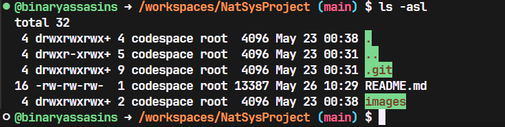
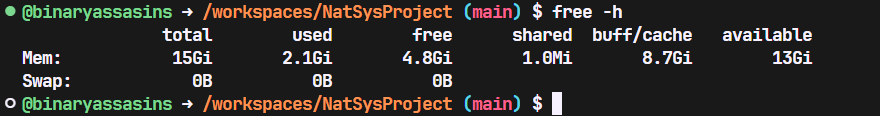
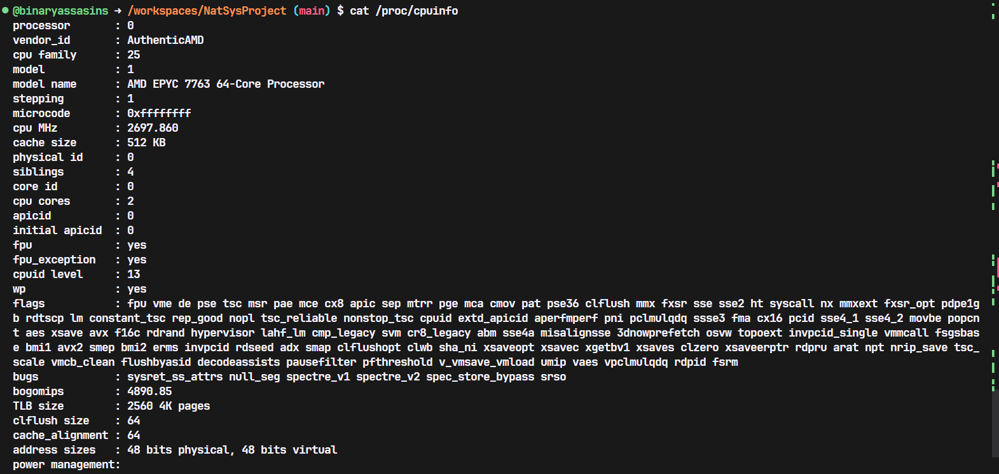
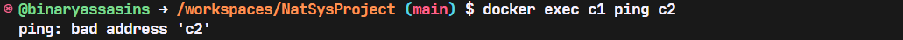

# Net&Sys Assignment: Running Containers for Application Development

Group Name: NetRascal. 

Team Mates:
1. Mohamad Syafiq Asyraf Bin Bharudin
2. Ammar Hazir Bin Annas
3. Amir Hamzah Bin Ibrahim

## Rules
1. You are allowed to have **3 group** members.
2. When you complete the assignment, make sure to submit the repository link of your cloned project. Make sure all the files are as what you aspect in your repository. 
3. Answer all questions in the **README.md**, in your own repository. Either use the online VSCode, terminal or github to edit. Answers are expected where you see __Fill answer here__.
4. Learn how to use markdown. https://www.w3schools.io/file/markdown-introduction/

## Forking this project repository
1. First thing you need in doing this assignment is to have a github account. Make sure to sign up at https://www.github.com
2. The second thing you need is to fork the Net&Sys Assignment repository in your own github account. 

    1. Go to https://github.com/ZainabBashi/NatSysProject and click fork to copy the project into your own repository
    2. Make sure that the new fork is now in your own repository

***Questions:***

1. What is the link of the fork Net&Sys Assignment in your repository. ***(1 mark)*** ***<p>[Forked repo in binaryassassins project repo](https://github.com/binaryassasins/NatSysProject.git)</p>***
2. How many files and folders are in this repository. ***(1 mark)*** ***<p>1 folder with 6 png files (images) and 1 markdown file.</p>***


## Exploring github codespaces

1. The next thing that we will be doing is exploring codespaces. First of all, read about codespaces https://docs.github.com/en/codespaces/overview#what-is-a-codespace
2. Then go to the link https://github.com/codespaces and we shall start a new codespace.  
3. Click on ***New codespace***.
4. Choose your own Net&Sys Assignment repository to start your codespace.

 

5. Once you have created you codespace, you will see the following. You might already be familiar with this, since it will look similar to VSCode. 

 

6. You will see the [README file](./README.md) file. One is a preview of how it looks like on the web, and the other is the editing view in markdown language. 
7. Edit the [README file](./README.md). Make sure you have your group details correct, ie, group name and team members along with their matric Numbers. 
8. Once you have finish editing, click File->Save or ***ctrl-s*** to save it. 
9. After saving, you will notice an M or U next to your file. You will need to commit any changes, whenever you make changes so that it is uploaded to the github repository. 

 

10. Click on the source control, hint: its on the left side panel, and it will list down the files that have been modified or updated. Click on commit. It will then ask you "Would you like to stage all your changes and commit them directly?" Just say yes, and a new tab will appear. Type a message to log what you have done, and click on the check mark. 

 

11. After that, sync the changes to the main repository. 
12. Make sure to commit and sync your files to the main repository, or else, your work will be lost since it is not saved into the main repository when you submit your project.

***Questions:***

1. What is default OS used to run the virtual environment for codespaces. ***(1 mark)*** ***<p>Ubuntu Linux.</p>***
2. What are the two options of RAM, disk and vcpu configuration you can have in running codespaces . ***(1 mark)*** <strong><p>4-core 8GB RAM & 32GB Disk - 8-core 16GB RAM & 64GB Disk</p></strong>
3. Why must we commit and sync our current work on source control? ***(1 mark)*** ***<p>By committing and syncing work regularly, we can maintain a robust, collaborative, and safe development environment. This allows us to track the evolution of our codes, changes made, trigger automated tests and deployments ensuring that our code is continuously tested and integrated with other changes (CI/CD pipelines), offers branching feature which allows us to develop new ideas without affecting codebase (master branch) as well as creating backup of our changes if something wrong happen.</p>***

## Exploring the Terminal

1. Look at the TERMINAL tab. Explore and run commands according to the questions below. 
2. You can include your answers as images, or cut and paste the output here. If you are cutting and pasting your answers, wrap your answers in the codeblock clause in markdown. For example, if i run the command **whoami** the the output would look like the one below.
```bash
@joeynor ➜ /workspaces/OSProject (main) $ whoami 
codespace
```


***Questions:***

Look at the TERMINAL tab. Run the following commands and provide the output here. 

1. Run the command **pwd** . ***(1 mark)*** .
2. Run the command **cat /etc/passwd** . ***(1 mark)*** 
3. Run the command **df** . ***(1 mark)*** 
4. Run the command **du** . ***(1 mark)*** 
5. Run the command **ls** . ***(1 mark)*** 
6. Run the command **ls -asl** . ***(1 mark)*** 
7. Run the command **free -h** . ***(1 mark)*** 
8. Run the command **cat /proc/cpuinfo** . ***(1 mark)*** 
9. Run the command **top** and type **q** to quit. ***(1 mark)*** 
10. Run the command **uname -a**. ***(1 mark)*** 
11. What is the available free memory in the system. ***(1 mark)*** <strong><p>4.81Gi</p></strong>
12. What is the available disk space mounted on /workspace. ***(1 mark)*** <strong><p>14627556</p></strong>
13. Name the version and hardware architecture of the linux Virtual environment. ***(1 mark)*** <strong><p>Version: #22~22.04.1-Ubuntu SMP<br>Arch: x86_64</p></strong>
14. What is the difference between **ls** vs **ls -asl**. ***(1 mark)*** <strong><p>ls: list the directory contents<br>ls -asl: list directory contents including dot files (.) together with their allocated size, in blocks and print them using a long listing format</p></strong>
15. What is the TLB size of the Virtual CPU. ***(1 mark)*** <strong><p>2560 4K pages</p></strong>
16. What is the CPU speed of the Virtual CPU. ***(1 mark)*** <strong><p>2663.776MHz</p></strong>
17. What is the top running process that consumes the most CPU cycles. ***(1 mark)*** <strong><p>node</p></strong>

## Running your own container instance.

1. At the terminal, run a linux instance. By typing the following command. 
```
docker pull debian
docker run --detach -it debian
```
2. This will run the debian container. To check if the debian container is running, type
```bash
@joeynor ➜ /workspaces/OSProject (main) $ docker ps -a
CONTAINER ID   IMAGE     COMMAND   CREATED         STATUS         PORTS     NAMES
f65be1987f84   debian    "bash"    4 minutes ago   Up 4 minutes             romantic_jackson
```

3. Keep note of the name used by your container, this is usually given random names unless you specify your own name. Now run a bash command on the container. Make sure you use the name of your container instead of the one shown here. 
```bash
docker exec -i -t romantic_jackson /bin/bash
```

4. Create a file on the container. First you must make sure you are in the bash command prompt of the container. The container is new, and does not have any software other than the debian OS. To create a new file, you will need an editor installed. In the bash shell of the container, run the package manager apt-get to install nano text editor. 

```bash
root@f65be1987f84:~# apt-get update      

root@f65be1987f84:~# apt-get install nano

root@f65be1987f84:~# cd /root

root@f65be1987f84:~# nano helloworld.txt
```

5. Edit your helloworld.txt, create your messsage and save by typing ctrl-X. Once saved, explore using the container to see where the file is located. Then exit the shell, by typing **exit**.

6. Stop the container and run **docker ps -a**, and restart the container again. Is your file in the container still available?
```bash 
@joeynor ➜ /workspaces/OSProject (main) $ docker stop romantic_jackson

@joeynor ➜ /workspaces/OSProject (main) $ docker ps -a
CONTAINER ID   IMAGE     COMMAND   CREATED          STATUS                        PORTS     NAMES
f65be1987f84   debian    "bash"    19 minutes ago   Exited (137) 18 seconds ago             romantic_jackson

@joeynor ➜ /workspaces/OSProject (main) $ docker restart romantic_jackson
```

7. Stop the container and delete the container. What happened to your helloworld.txt?

```bash 
@joeynor ➜ /workspaces/OSProject (main) $ docker stop romantic_jackson

@joeynor ➜ /workspaces/OSProject (main) $ docker ps -a
CONTAINER ID   IMAGE     COMMAND   CREATED          STATUS                        PORTS     NAMES
f65be1987f84   debian    "bash"    19 minutes ago   Exited (137) 18 seconds ago             romantic_jackson

@joeynor ➜ /workspaces/OSProject (main) $ docker rm romantic_jackson
```

***Questions:***

1. Are files in the container persistent. Why not?. ***(1 mark)*** <strong><p>Containers use ephemeral storage (by default), which means the file system inside the container is temporary. When the container is removed, all the data stored in the container's file system is also deleted.</p></strong>
2. Can we run two, or three instances of debian linux? . ***(1 mark)*** <strong><p>Yes</p></strong>

## Running your own container with persistent storage

1. In the previous experiment, you might have notice that containers are not persistent. To make storage persistent, you will need to mount them. 
At the terminal, create a new directory called **myroot**, and run a instance of debian linux and mount myroot to the container. Find out the exact path of my root, and mount it as the root folder in the debian container. 
2. Create a file in /root on the container, the files should also appear in myroot of your host VM.

```bash 
@joeynor ➜ /workspaces/OSProject (main) $ mkdir myroot
@joeynor ➜ /workspaces/OSProject (main) $ cd myroot/
@joeynor ➜ /workspaces/OSProject/myroot (main) $ pwd
/workspaces/OSProject/myroot

@joeynor ➜ /workspaces/OSProject/myroot (main) $ docker run --detach -it -v /workspaces/OSProject/myroot:/root debian
```

***Questions:***

1. Check the permission of the files created in myroot, what user and group is the files created in docker container on the host virtual machine? . ***(2 mark)*** <strong><p>user: root<br>group: root</p></strong>
2. Can you change the permission of the files to user codespace.  You will need this to be able to commit and get points for this question. ***(2 mark)***
```bash
//use sudo and chown
sudo chown -R codespace:codespace myroot

```


## You are on your own, create your own static webpage

1. Create a directory called webpage in your host machine
2. Inside the directory, create a page index.html, with any content you would like
3. Then, run the apache webserver and mount the webpage directory to it. Hint:
```bash
## the -p 8080:80 flag points the host port 8080 to the container port 80

docker run --detach -v /workspaces/OSProject/webpage:/usr/local/apache2/htdocs/ -p 8080:80 httpd
```

4. If it works, codespace will trigger a port assignment and provide a URL for you to access your webpage like the one below.

 


5. You can also see the Port in the **PORTS** tab, next to the terminal tab.

6. You can then access your website by adding an index.html towards the end of your url link, like the one below. 

 

***Questions:***

1. What is the permission of folder /usr/local/apache/htdocs and what user and group owns the folder? . ***(2 mark)*** <strong><p>Permission: drwxrwxrwx+<br>User: 1000 (refers to codespace)<br>Group: 1000 (refers to codespace)</p></strong>
2. What port is the apache web server running. ***(1 mark)*** <strong><p>8080</p></strong>
3. What port is open for http protocol on the host machine? ***(1 mark)*** <strong><p>80</p></strong>

## Create SUB Networks

1. In docker, you can create your own private networks where you can run multiple services, in this part, we will create two networks, one called bluenet and the other is rednet
2. Run the docker create network to create you networks like the ones below
```bash
## STEP 1:
## Create Networks ##
docker network create bluenet
docker network create rednet`

## STEP 2: (automatically running)
## Create (1) Container in background called "c1" running busybox image ##
docker run -itd --net bluenet --name c1 busybox sh
docker run -itd --net rednet --name c2 busybox sh
```
***Questions:***

1. Describe what is busybox and what is command switch **--name** is for? . ***(2 mark)*** <strong><p>It is a software suite that provides several Unix utilities in a single executable file. It is often referred to as "The Swiss Army Knife of Embedded Linux" due to its versatility and compact size. BusyBox combines tiny versions of many common UNIX utilities into a single small executable, making it ideal for environments with limited resources, such as embedded systems, minimal Docker containers, and bootable rescue disks. Command --name is used to specify a name of an instance.</p></strong>
2. Explore the network using the command ```docker network ls```, show the output of your terminal. ***(1 mark)*** 
3. Using ```docker inspect c1``` and ```docker inspect c2``` inscpect the two network. What is the gateway of bluenet and rednet.? ***(1 mark)*** <strong><p>c1: 172.18.0.1<br>c2: 172.19.0.1</p></strong>
4. What is the network address for the running container c1 and c2. <strong><p>c1: 172.18.0.0<br>c2: 172.19.0.0</p></strong>
5. Using the command ```docker exec c1 ping c2```, which basically issue a ping from container c1 to c2. Are you able to ping? Show your output . ***(1 mark)*** <strong><p>Before Network Bridging: After Network Bridging: </p></strong>

## Bridging two SUB Networks
1. Let's try this again by creating a network to bridge the two containers in the two subnetworks
```
docker network create bridgenet
docker network connect bridgenet c1
docker network connect bridgenet c2
docker exec c1 ping c2
```

## What to submit

1. Make sure to commit all changes on your source control, and make sure your source control is sync to the repository. 
2. Check your repository link, to see if all the files and answers are included in the repository. 
3. Submit through italeem, by providing the link to your repository.
4. Due by ***30 May, 2024***
